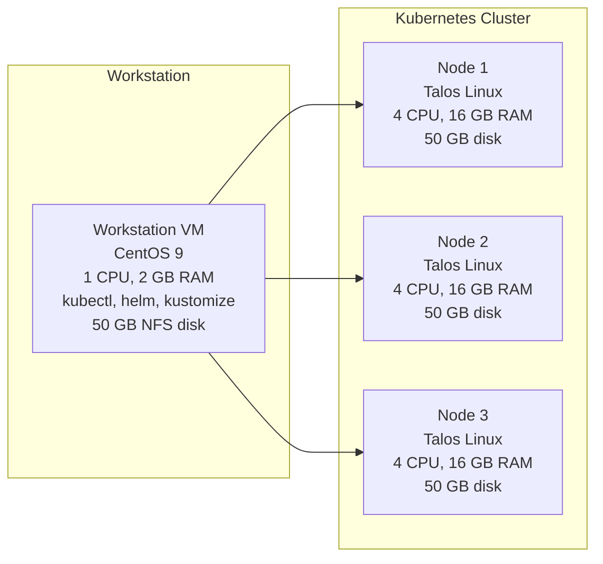

# Infrastructure Overview

This project consists of a development workstation VM and a three-node Kubernetes cluster.

## Architecture Diagram



## Components

### Development Workstation

* **OS:** CentOS 9
* **vCPU:** 1
* **Memory:** 2 GB
* **Storage:** 50 GB (NFS server)
* **Tools:** kubectl, helm, customize, talosctl

### Kubernetes Cluster Nodes (×3)

Each node has:

* **OS:** Talos Linux
* **vCPU:** 4
* **Memory:** 16 GB
* **Storage:** 50 GB

## Prerequisites

* Hypervisor (VMware, VirtualBox, KVM)
* **Workstation:** CentOS 9 ISO or image
* **Cluster nodes:** Talos Linux ISO
* Network: All VMs on same subnet
* Workstation (acting as NFS server) reachable by cluster nodes (acting as NFS server) reachable by cluster nodes

## Next Steps

1. **Provision VMs** with specs above.

2. **Setup NFS Server Disk** on the CentOS 9 workstation:

   ```bash
   # Define and export disk variable
   export DISK=/dev/sdb

   # 1. Partition the disk (create single primary partition)
   sudo parted "$DISK" --script mklabel gpt mkpart primary 0% 100%
   PARTITION="${DISK}1"

   # 2. Format the partition
   sudo mkfs.ext4 "$PARTITION"

   # 3. Create mount point and mount
   sudo mkdir -p /mnt/nfs-storage
   sudo mount "$PARTITION" /mnt/nfs-storage

   # 4. Persist mount in /etc/fstab
   echo "$PARTITION  /mnt/nfs-storage  ext4  defaults  0 0" | sudo tee -a /etc/fstab

   # 5. Install NFS server packages
   sudo dnf install -y nfs-utils

   # 6. Configure NFS exports
   echo "/mnt/nfs-storage *(rw,sync,no_root_squash)" | sudo tee /etc/exports
   sudo exportfs -a
   sudo systemctl enable --now nfs-server
   ```

3. **Install Kubernetes using Talos Linux** on booted Talos ISO nodes:

   ```bash
   talosctl gen config kubeflow-kubernetes https://<CONTROL_PLANE_IP>:6443 --kubernetes-version 1.32.0 --output-dir _out
   
   export CONTROL_PLANE_IP=<CONTROL_PLANE_IP>

   # Apply control plane config
   talosctl apply-config --insecure --nodes $CONTROL_PLANE_IP --file _out/controlplane.yaml

   # Apply worker node config (repeat for each worker IP)
   talosctl apply-config --insecure --nodes <WORKER_NODE_IP> --file _out/worker.yaml

   # Set up talosctl context
   export TALOSCONFIG="_out/talosconfig"
   talosctl config endpoint $CONTROL_PLANE_IP
   talosctl config node $CONTROL_PLANE_IP

   # Bootstrap the cluster
   talosctl bootstrap

   # Retrieve kubeconfig
   talosctl kubeconfig .
   mkdir -p ~/.kube
   mv kubeconfig ~/.kube/config

   # Verify nodes
   kubectl get nodes
   ```

4. **Create Docker Registry Secret**:

   ```bash
   kubectl create secret docker-registry my-registry-secret \
     --docker-server=<registry-server> \
     --docker-username=<username> \
     --docker-password=<password> \
     --docker-email=<email>
   ```

5. **Deploy NFS Provisioner and Create StorageClass**:

   ```bash
   helm repo add nfs-subdir-external-provisioner \
    https://kubernetes-sigs.github.io/nfs-subdir-external-provisioner
    helm repo update

   helm install nfs-provisioner \
    nfs-subdir-external-provisioner/nfs-subdir-external-provisioner \
    --set nfs.server=<workstation-ip> \
    --set nfs.path=/mnt/nfs-storage \
    --set storageClass.defaultClass=true

   ```

*End of README.md*
